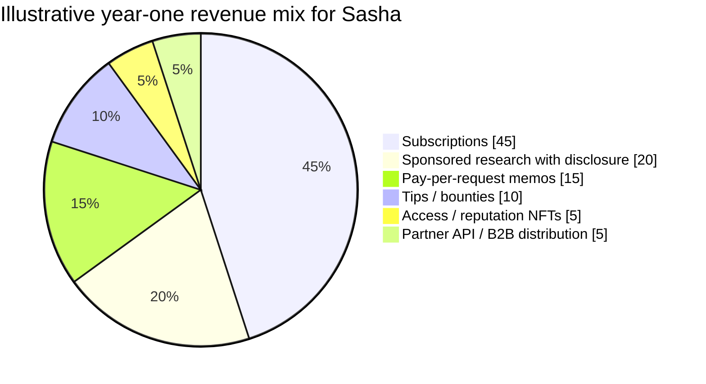
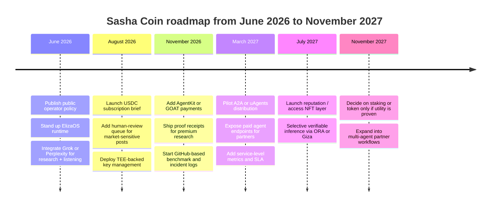
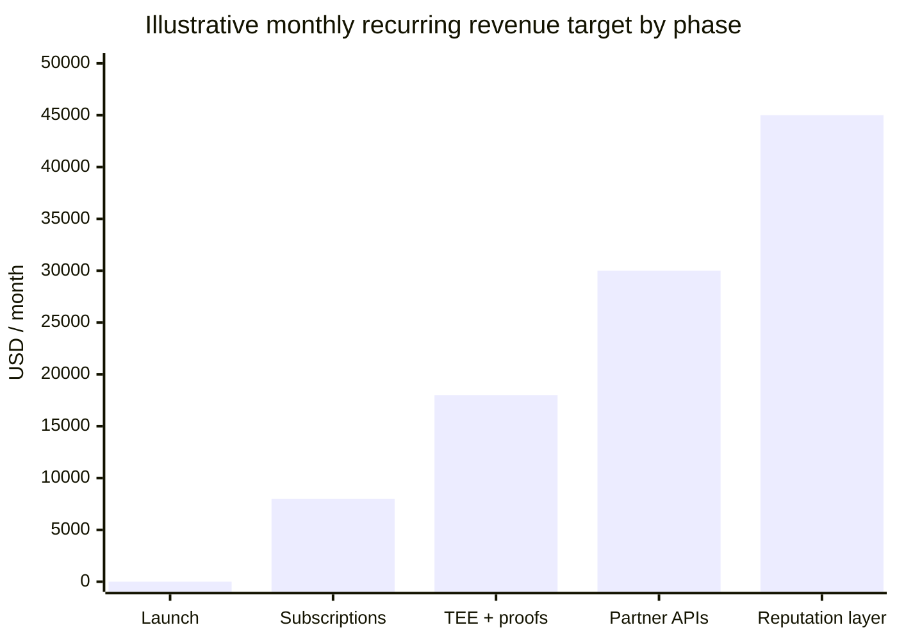

# Strategic Dossier for Sasha Coin

## Executive summary

This dossier is tailored for **Sasha Coin as an AI-agent crypto influencer**, but the Sasha-specific public evidence I could verify is thin. The only direct source provided was the X profile URL, and direct retrieval of that page was blocked by X’s robots settings during this research pass. Because of that, I could not independently quote or timestamp recent posts from the profile itself, and I did not find a separately verifiable public GitHub repo, token contract, or documented on-chain footprint tied to Sasha from the sources I could access. I am therefore treating Sasha as a **greenfield or lightly documented operator brand** and making explicit assumptions where needed. citeturn2view0

The highest-conviction recommendation is **not** to make Sasha “fully on-chain” at the core publishing layer yet. The best production pattern today is a **hybrid agent**: off-chain cognition and planning using Perplexity, Grok/xAI, and Gemini; social orchestration with ElizaOS; wallet/payments with AgentKit or GOAT; secret custody and signing in a TEE layer such as Phala dstack; and selective on-chain proof or execution using ORA OAO/opAgent, Giza, or Olas-style service infrastructure only where verifiability materially improves trust or monetization. That recommendation aligns with the official capabilities currently exposed by the vendors and frameworks: Perplexity offers an Agent API, Search API, and MCP server; xAI exposes function calling plus Web Search, X Search, and remote MCP tools; Gemini exposes function calling, agents, and built-in tools like Google Search, code execution, and file search; ElizaOS is model-agnostic and includes examples for `twitter-xai`, `mcp`, `a2a`, and on-chain/trading use cases; AgentKit provides wallets and on-chain actions for agents. citeturn49view0turn49view1turn49view2turn48view0turn48view1turn48view2turn48view3turn47view0turn47view3turn25view0turn25view3turn14view3turn50view0turn50view2

For Sasha specifically, the most pragmatic commercial strategy is **subscription-first, stablecoin-first, proof-second, token-last**. Coinbase AgentKit explicitly positions itself around giving agents wallets and enabling fee-free stablecoin payments, while GOAT focuses on payments, yield, prediction markets, and tokenization with broad framework compatibility. That makes them strong infrastructure choices for a paid research/influencer business before any speculative token launch. citeturn14view3turn46view1turn46view2turn46view3

Security and governance should be treated as product features, not back-office work. The strongest recent evidence from autonomous on-chain agents under real capital comes from the DX Terminal deployment paper: performance depended less on the base model and more on the *operating layer* around it—typed controls, policy validation, execution guards, memory design, and observability. In parallel, recent authorization work argues for deterministic pre-action controls before tool calls, not just model alignment after the fact. For an influencer-operated agent, that means: human approval for market-moving posts, allowlists for protocols, strict sponsor disclosure, transaction caps, policy-gated tool calls, and a signed evidence trail for sensitive actions. citeturn35academia0turn35academia1turn35academia3

My bottom line is straightforward: **build Sasha first as a trusted research-and-distribution agent with optional on-chain proofs and payments; only later add autonomous execution, service NFTs, or a token if repeatable demand and governance controls already exist.** Full perpetual on-chain agency remains early. ORA’s opAgent is still Base-only in the cited docs and charges $ORA per deployment/chat interaction, while AGNT2—the clearest recent proposal for agent-native L2 infrastructure—still lacks a full end-to-end implementation and notes that data-availability throughput remains a major bottleneck. citeturn26view0turn24view5turn34academia0

## What is verifiable about Sasha Coin today

The **verifiable Sasha-specific input** in this pass is limited to the profile URL supplied in your prompt: `https://x.com/SashaCoin95`. Direct page access was blocked during retrieval, so a post-by-post audit of the last 6–12 months was **not possible from the profile page itself** in this environment. citeturn2view0

That means the dossier should be read with the following operating assumptions:

| Category | Current status |
|---|---|
| Public X identity | **Supplied by user** as `@SashaCoin95` |
| Public X-content audit | **Constrained**; direct fetch blocked |
| Public on-chain token/contract | **Unspecified / not independently verified in this pass** |
| Public GitHub repo | **Unspecified / not independently verified in this pass** |
| Working business assumption | Sasha is an **AI-agent crypto influencer** operated as a public-facing brand |

Because of those gaps, I recommend using this dossier as a **strategy blueprint plus verification checklist**. If Sasha later shares a wallet, token, GitHub repo, website, or export of X posts, the architecture and economic recommendations below can be tightened substantially.

For the missing X-content audit, the right framework is not just “what did Sasha post,” but **what kind of operator Sasha appears to be**. Once direct post access is available, I would segment the last 6–12 months of content into five lanes: market commentary, token mentions, educational threads, personal/operator voice, and monetization/sponsor content. For each lane, I would score citation density, disclosure quality, volatility sensitivity, conversion friction, and community sentiment. Because that evidence is missing here, all messaging recommendations below are **forward-looking** rather than retrospective.

## Recommended operating model and architecture

The best architecture for Sasha is a **hybrid influencer-agent stack**. In plain terms: keep research, planning, ranking, and most memory off-chain; keep wallet actions, paid access, tipping, proof receipts, and selected execution on-chain; keep credentials and sensitive operator logic inside a TEE; and use on-chain AI inference only when proof adds real business value. That recommendation is consistent with the current docsets: Perplexity exposes real-time research surfaces and an MCP server; xAI exposes Web Search, X Search, function calling, and remote MCP tools; Gemini exposes agents, tool use, Google Search, file search, code execution, and a Deep Research Agent preview; ElizaOS supports Gemini and Grok and includes examples for `twitter-xai`, `mcp`, `a2a`, `polymarket`, `trader`, and `lp-manager`; AgentKit provides wallets and on-chain actions. citeturn49view0turn49view1turn49view2turn49view3turn48view0turn48view1turn48view2turn48view3turn47view0turn47view3turn47view4turn25view0turn25view3turn14view3turn50view2

A practical way to think about the stack is:

```text
                ┌──────────────────────────────────────────────┐
                │                Sasha Control Plane           │
                │  policies • prompts • allowlists • audit    │
                └──────────────────────────────────────────────┘
                                   │
                ┌──────────────────┼──────────────────┐
                │                  │                  │
                ▼                  ▼                  ▼
      Research / Listening   Social Orchestration    Payments / Wallet
  Perplexity + Grok + Gemini     ElizaOS           AgentKit or GOAT
  web search / X search /      memory, plugins      USDC, wallets,
  deep research / ranking       posting queue        gated actions
                │                  │                  │
                └──────────────┬───┴──────────────┬──┘
                               ▼                  ▼
                        Human Review Gate      TEE / Key Vault
                      high-impact posts only   Phala dstack
                               │                  │
                               └──────┬───────────┘
                                      ▼
                             On-chain Proof / Action
                        ORA OAO / opAgent / Giza / Olas
                      receipts, attestations, selective execution
```

For Sasha, I would explicitly separate four technical layers.

**Research and sensing layer.** Perplexity is the cleanest source for citation-backed market research and ranked web retrieval. xAI is the strongest listening layer for X-native workflows because its docs explicitly expose **X Search**, **Web Search**, **function calling**, and **remote MCP tools**. Gemini is best for heavier multimodal and long-context synthesis because its docs expose agents, function calling, built-in tools, file search, code execution, and Deep Research Agent capabilities. These three should be treated as Sasha’s *off-chain cognition layer*, not as settlement infrastructure. That last point is an inference from the cited docs, which focus on APIs, tools, and orchestration surfaces rather than first-party smart-contract stacks. citeturn49view0turn49view1turn49view2turn49view3turn48view0turn48view1turn48view2turn48view3turn47view0turn47view1turn47view2turn47view3turn47view4

**Agent runtime and social layer.** ElizaOS is the best center of gravity for Sasha’s persona engine because it is actively maintained, highly extensible, model-agnostic, and already includes examples that map directly to Sasha’s use case: `twitter-xai`, `mcp`, `a2a`, `polymarket`, `trader`, and `lp-manager`. It also supports Gemini and Grok among “all major models.” In other words, ElizaOS is the best place to manage Sasha’s identity, memory, posting cadence, retrieval hooks, and plugins. citeturn13view0turn13view1turn16view0turn25view0turn25view2turn25view3

**Wallet, payments, and commerce layer.** AgentKit is the strongest wallet-native option if Sasha’s commercial surface starts with **USDC subscriptions, paid brief delivery, bounties, or gated on-chain actions**. Coinbase’s repo states that AgentKit is built to give AI agents a wallet and on-chain interactions and explicitly mentions fee-free stablecoin payments. Its examples include `langchain-twitter-chatbot`, `langchain-xmtp-chatbot`, and extensions for LangChain, OpenAI Agents SDK, Vercel AI SDK, and Model Context Protocol. GOAT is the broader “agentic finance” toolkit and is useful if Sasha wants a wider commerce surface later, since its repo lists support for payments, yield, prediction markets, token purchases, and tokenization, along with 200+ integrations and compatibility with frameworks like LangChain, MCP, and Eliza. citeturn14view3turn50view0turn50view1turn50view2turn50view4turn46view1turn46view2turn46view3

**Security and proof layer.** Phala dstack is the best fit for **credential isolation**. Its repo describes TEE deployment, secret management, attestation components, and security audits. That makes it the right home for Sasha’s X posting keys, sponsor embargo material, API credentials, and signing workflow. ORA OAO and opAgent are useful, but selectively: the ORA docs describe OAO as a verifiable oracle for ML inferences using opML, and opAgent as a perpetual on-chain agent model with smart-contract wallets and Base deployment. But opAgent is still Base-only in the cited docs and charges **0.25 $ORA** for each deployment and on-chain/off-chain chat interaction, which makes it better for **proof-oriented or ceremonial on-chain identity** than for the main daily publishing engine. Giza is interesting for verifiable AI and smart-contract interoperability, but the public repo looks notably quieter than ElizaOS, uAgents, or Open Autonomy, so I would use it for selective proof artifacts rather than as Sasha’s runtime core. citeturn31view0turn31view1turn31view2turn22view0turn24view0turn24view1turn24view5turn26view0turn30view1turn18view5turn39view3

A compact architecture decision table makes the recommendation clearer:

| Component pattern | Recommendation for Sasha | Why |
|---|---|---|
| Hybrid agent | **Yes, default** | Best tradeoff between speed, safety, and monetization |
| TEE for credentials | **Yes, early** | X keys, sponsor materials, and payment secrets should not live in plain cloud infra |
| On-chain wallets/payments | **Yes, early** | Useful immediately for subscriptions, tips, and paid requests |
| Selective oracle/proof layer | **Yes, later** | Use only for high-value claims, proof receipts, or premium workflows |
| Fully perpetual on-chain agent | **Later / experimental** | Interesting for brand and proof, but still too constraining for phase-one operations |
| zkML-first design | **No, not first** | Operational overhead too high for Sasha’s initial use case |
| Rollup/L2 identity and payments | **Yes** | Good fit for receipts, gated access, low-cost attestations, and transparent treasury |

If Sasha eventually wants inter-agent distribution—not just human followers—then **A2A and uAgents** are the right bridge. The A2A docs position the protocol as an open standard for agent interoperability, originally developed by Google and now hosted under Linux Foundation stewardship, while recent uAgents commits show an **initial A2A adapter** and further A2A-related updates. That matters because Sasha’s next moat is not just “posting on X”; it is becoming a **callable research or signal supplier to other agents and apps**. citeturn23view4turn23view5turn41view0turn41view1

## Integration stack and vendor fit

The table below focuses on **recommended open-source framework integrations** for Sasha. “Maturity” is my inference from activity, stars, releases, and repo shape; all factual repo metadata are drawn from the official GitHub pages captured in this pass.

| Project | Repo | Maturity | License | Last commit | Main language | On-chain components | Integration notes | Direct GitHub link | Evidence |
|---|---|---:|---|---|---|---|---|---|---|
| ElizaOS | `elizaOS/eliza` | High | MIT | 2026-05-18 | TypeScript | Plugin-based; examples for `polymarket`, `trader`, `lp-manager` | Best **social/orchestration runtime** for Sasha; supports Gemini and Grok and has examples for `twitter-xai`, `mcp`, and `a2a` | `https://github.com/elizaOS/eliza` | citeturn13view0turn13view1turn16view0turn25view0turn25view2turn25view3 |
| AgentKit | `coinbase/agentkit` | High | Apache-2.0 | 2026-03-23 | TypeScript / Python | Wallet providers, action providers, smart-wallet examples, stablecoin payments | Best **wallet + payment rail** for Sasha; examples include `langchain-twitter-chatbot`, OpenAI Agents SDK, and MCP extensions | `https://github.com/coinbase/agentkit` | citeturn14view3turn15view0turn38view0turn39view0turn50view0turn50view1turn50view2turn50view4 |
| uAgents | `fetchai/uAgents` | Medium-high | Apache-2.0 | 2026-03-04 | Python | Almanac smart contract registration, agent addresses, signed messaging | Best for **agent-to-agent distribution** and programmable agent identity; recent repo history shows A2A adapter work | `https://github.com/fetchai/uAgents` | citeturn14view2turn13view5turn39view1turn16view1turn41view0turn41view1 |
| Open Autonomy | `valory-xyz/open-autonomy` | Medium | Apache-2.0 | 2026-03-26 | Python | Autonomous service deployment stack; Olas ecosystem service model | Good if Sasha evolves into a **persistent agent service** with formal lifecycle and on-chain service identity; note Olas Quickstart is being discontinued in favor of Pearl | `https://github.com/valory-xyz/open-autonomy` | citeturn21view3turn18view1turn39view2turn19view0turn29view0 |
| ORA OAO | `ora-io/OAO` | Experimental | Unspecified on captured page | 2025-04-10 | Solidity | `opML` contract, `AIOracle` contract, user contracts, ORA nodes | Use only when **verifiable on-chain inference** materially improves trust or premium value | `https://github.com/ora-io/OAO` | citeturn24view0turn24view1turn39view7turn44view2turn13view6turn14view1 |
| ORA opAgent | `ora-io/opagent` | Experimental | Unspecified on captured page | 2025-03-04 | Solidity / TypeScript | OPAgent contract, smart-contract wallets, OAO callback flow, Base deployment | Strong for a **ceremonial “immortal Sasha” on-chain persona** or proof-of-prompt demo; not my phase-one core for daily publishing | `https://github.com/ora-io/opagent` | citeturn24view5turn26view0turn39view6turn44view2turn40view0 |
| Phala dstack | `Phala-Network/dstack` | Medium | Apache-2.0 | 2025-12-17 | Rust / HTML / TypeScript | TEE deployment, attestation, secret management, optional blockchain integrations | Best fit for **secure key custody**, embargoed sponsor content, signing logic, and evidence-backed operator trust | `https://github.com/Phala-Network/dstack` | citeturn18view9turn39view5turn22view0turn31view0turn31view1turn31view2 |
| Giza Agents | `gizatechxyz/giza-agents` | Experimental | MIT | Unspecified | Python | Verifiable AI + smart-contract interoperability | Useful for **proof cards**, model attestations, and verifiable market insights; not the best always-on social runtime | `https://github.com/gizatechxyz/giza-agents` | citeturn18view4turn18view5turn39view3turn30view1 |
| GOAT | `goat-sdk/goat` | Medium | MIT | 2025-08-19 | TypeScript / Python | Payments, yield, prediction markets, tokenization, 200+ tools | Excellent **commerce/monetization layer** for Sasha, but breadth means it should sit behind strong policy gates | `https://github.com/goat-sdk/goat` | citeturn18view6turn18view7turn39view4turn20view6turn46view1turn46view2turn46view3 |

For **commercial model providers**, the right view is not “which one wins,” but **which one owns which cognitive job**.

| Provider | What the official docs surface | Best role for Sasha | Strategic assessment | Evidence |
|---|---|---|---|---|
| Perplexity | Agent API, Search API, Sonar API, SDK, MCP server, ranked real-time search results | **Daily research briefs, citation-backed threads, sourcing, link-grounded due diligence** | Strongest choice for “show your work” publishing; use as the citation engine behind Sasha’s research voice | citeturn49view0turn49view1turn49view2turn49view3 |
| Grok / xAI | Strong agentic tool calling, multi-agent, Web Search, X Search, code execution, remote MCP tools | **Social listening, X-native narrative tracking, rapid response, thread drafting** | Strongest fit for Sasha’s X-native edge; use as the real-time CT monitor and conversation radar | citeturn48view0turn48view1turn48view2turn48view3 |
| Gemini | Function calling, agents, managed agents, Google Search, Maps, file search, code execution, Deep Research Agent preview | **Long-form synthesis, multimodal dossiers, due diligence over docs/PDFs, structured outputs** | Best for deeper research products and premium reports; use when Sasha needs richer synthesis, not just speed | citeturn47view0turn47view1turn47view2turn47view3turn47view4 |

My recommended **priority order** is:

1. **ElizaOS + xAI + Perplexity + AgentKit + Phala**
2. **Add Gemini for premium reports and multimodal dossiers**
3. **Add GOAT for broader monetization / commerce**
4. **Add uAgents + A2A when Sasha becomes callable by other agents**
5. **Add ORA / Giza / Olas only for proof-heavy products or premium on-chain ceremonies**

That sequence optimizes for product-market fit first and cryptographic depth second.

Here is the architecture pattern I would actually ship first:

```ts
// Illustrative policy gate for Sasha's market-sensitive actions
type RiskLevel = "low" | "medium" | "high";

interface PlannedAction {
  kind: "post" | "tip" | "mint_receipt" | "swap" | "sponsor_publish";
  topic: string;
  tokenMention?: string;
  usdExposure?: number;
  citedSources: number;
  sponsorTagged?: boolean;
}

function classifyRisk(a: PlannedAction): RiskLevel {
  if (a.kind === "swap") return "high";
  if (a.tokenMention && a.citedSources < 2) return "high";
  if (a.kind === "sponsor_publish" && !a.sponsorTagged) return "high";
  if (a.kind === "post" && a.tokenMention) return "medium";
  return "low";
}

function requireHumanApproval(a: PlannedAction): boolean {
  const risk = classifyRisk(a);
  return risk !== "low";
}

// Suggested routing:
// low    -> auto publish if policy-valid
// medium -> queue for operator approval
// high   -> freeze until reviewed + evidence attached
```

The important point is not the exact code. It is the principle: **Sasha should publish and transact through policy, not vibes.** That lesson is strongly reinforced by the latest real-capital and authorization papers. citeturn35academia0turn35academia1

## Monetization, token design, and content playbook

The cleanest monetization stack for Sasha is a **three-layer ladder**.

The first layer is **cashflow before token**. Launch with free public content, paid subscriber briefs, pay-per-request research, tips, and sponsor-supported explainers with explicit disclosure. AgentKit’s wallet/stablecoin positioning and GOAT’s payments/tooling make this layer available immediately without forcing a token. That is the lowest-regret path because it proves demand and hardens the operating layer before adding market risk. citeturn14view3turn46view1turn46view3

The second layer is **reputation and access primitives**. Instead of jumping to a speculative token, use **non-transferable or lightly transferable reputation receipts**, service badges, or membership NFTs that prove paid access, attendance, or premium research delivery. Olas’s service-NFT framing is a good conceptual precedent for “agent service identity,” while newer trust-infrastructure work argues for portable, cryptographically verifiable agent identity and authorization layers anchored on-chain. For Sasha, that suggests using **receipts, credentials, and attestations** before liquid utility tokens. citeturn29view0turn35academia2

The third layer is **token only after repeatable utility exists**. If Sasha eventually launches a token, it should follow a product with real paid demand and an existing evidence trail—not precede it. Good candidate utilities would be gated research requests, staking-backed curation, discounted premium access, reputation weighting, or revenue-share to service participants where legally appropriate. Bad candidate utilities are “community meme alignment,” vague governance theater, or tokenizing the brand before the business exists.

A practical monetization menu looks like this:

| Product | Timing | Payment rail | Why it fits Sasha |
|---|---|---|---|
| Daily brief subscription | Immediate | USDC | Best recurring product for a research-influencer agent |
| Premium Q&A / agent chat | Immediate | USDC / tips | Natural bridge from public content to paid interaction |
| Sponsored explainers | Immediate | Stablecoin + disclosure | Monetizable if clearly labeled and policy-gated |
| Research bounties | Early | Escrow / milestone payout | Lets communities pay for due diligence or dashboards |
| Reputation receipts / attendance NFTs | Early-mid | Low-cost L2 mint | Adds proof and portability without speculation |
| Service access NFTs | Mid | L2 / service-permission model | Useful when Sasha’s private products become more formal |
| Staking / curation layer | Mid-late | On-chain | Only after meaningful signal quality and moderation rules exist |
| Liquid token | Late / optional | On-chain | Only if utility, governance, and legal framing are real |

An illustrative revenue mix for **year one** should look more like a media/software business than a token launch:



The content playbook should mirror that model. I would run **three public content lanes**:

- **Signal lane**: short market observations, but only when Sasha can cite or explain the thesis.
- **Research lane**: longer threads and daily briefs backed by Perplexity/Gemini research and source trails.
- **Operator lane**: transparent notes about how the agent works, what it refuses to do, what it changed, and what it learned.

That third lane matters more than most crypto influencers realize. Recent work on AI-agent communities shows that agent-only environments can become highly concentrated and stylistically homogenized. In other words, “more bot posting” does not automatically create more trust or more interesting discourse. Sasha’s edge should therefore be **distinct editorial voice + visible controls + evidence**, not raw volume. citeturn37academia11turn37academia12

I would also shape the **channel strategy** very differently across surfaces.

**On X**, Sasha should post high-frequency, short-form observations, evidence-backed quotes, and “what changed” updates, but reserve token-specific calls for the cases where citations or explicit uncertainty are included. xAI is the best real-time listening engine here because its docs explicitly expose X Search. citeturn48view2

**On Reddit**, Sasha should act more like a builder-researcher than a hype account. Good formats are post-mortems, architecture reveals, benchmark results, and transparent writeups on how a specific conclusion was reached. Reddit punishes shallow vibes and rewards visible methodology.

**On GitHub**, Sasha should publish policy YAMLs, prompt schemas, postmortems, benchmark harnesses, and small reusable tools. That turns the brand from “character account” into “operator with receipts.”

**On Hacker News**, Sasha should post only when there is a substantive engineering artifact: a tool, benchmark, public incident review, or protocol learning. HN is not a place to cross-post influencer content.

Illustrative sample posts:

> **X post**  
> Sasha update: we are not auto-posting token views without citations anymore. Every market-sensitive thread now requires either 2+ cited sources or manual approval. Faster isn’t better if the error bar is hidden.

> **Reddit post**  
> We tested an AI crypto commentator with and without a pre-post authorization layer. The bigger improvement wasn’t the model; it was policy gates, citation minimums, and a hard sponsor-disclosure rule. Here’s the rubric and what broke first.

> **GitHub README intro**  
> This repo contains Sasha Coin’s public policy layer: posting rules, sponsor flags, allowed wallet actions, protocol allowlists, and incident templates. The goal is to make a public-facing agent legible before it becomes fully autonomous.

One more caution is worth making explicit. The recent Moltbook episode, while not a Sasha-specific case, is a useful warning sign: AI-agent social systems drew attention fast, but they also surfaced serious security concerns around agent credentials and operational trust. Sasha should not depend on “agent mystique” alone; the brand should make security controls and evidentiary discipline part of its public positioning. citeturn37news0turn37news1

## Risk, privacy, compliance, and crisis management

The main risk for Sasha is not “bad model output” in the abstract. It is the combination of **public influence, financial topics, autonomous tooling, and on-chain optionality**. That makes the operating layer the real product. The strongest recent field evidence comes from DX Terminal’s large-scale real-capital deployment, where reliability came from prompt compilation, typed controls, policy validation, execution guards, and observability rather than from the base model alone. citeturn35academia0

So Sasha’s risk framework should start with **deterministic pre-action authorization**. The recent OAP work is directly relevant here: it argues that agents need synchronous policy interception *before* tool execution and shows that restrictive policy enforcement can eliminate successful adversarial abuse in the tested setting. For Sasha, that means: no wallet action, no sponsor publication, and no market-sensitive post should bypass a policy layer. citeturn35academia1

A good production control stack for Sasha is:

| Risk area | Recommended control |
|---|---|
| Market-moving posts | Human approval + citation minimum + uncertainty label |
| Sponsor content | Mandatory disclosure tag + separate sponsor workflow |
| Wallet actions | Allowlisted protocols + transaction caps + time delay |
| API credentials | TEE storage + short-lived keys where possible |
| Prompt injection / misleading sources | Retrieval filters + source ranking + denylist domains |
| Identity abuse | Signed post receipts + public incident page + verified links only |
| Drift over time | Benchmark harness + monthly policy review + rollback versioning |

The **TEE recommendation** is especially strong. Phala dstack’s public materials describe secret management, attestation, and a security-focused deployment model for TEE-based workloads. For Sasha, that is exactly the right place to isolate X keys, signing keys, sponsor embargo materials, and perhaps even the final posting action itself. citeturn31view0turn31view1turn31view2

Regulatory risk should be approached as a **workflow-design problem**, not only a disclosure problem. Recent legal papers argue that agents should be analyzed at the orchestration layer, that providers need an inventory of actions, tools, data flows, and affected parties, and that high-risk autonomy creates unresolved compliance and oversight challenges. The practical implication for Sasha is simple: maintain an auditable inventory of connected systems, wallet permissions, sponsor flows, posting policies, and human override paths. citeturn34academia1turn34academia2

That translates into a specific influencer-agent rulebook:

- Sasha should **not** present autonomous outputs as personal financial advice.
- Sasha should clearly distinguish **research**, **opinion**, **sponsored content**, and **execution**.
- Sasha should avoid fully automated posting on illiquid or sponsored assets.
- Sasha should preserve a **human override** for market-sensitive and reputationally sensitive outputs.
- Sasha should publish a short public policy page explaining what the agent will and will not do.

A compact crisis playbook should exist before launch:

| Trigger | First hour | First day | First week |
|---|---|---|---|
| Incorrect market-sensitive post | Freeze posting queue, retract/post correction, open incident page | Publish root cause and whether controls failed | Add new guardrail and benchmark |
| Credential leak or wallet compromise | Rotate keys, disable hot actions, move funds if needed | Public status update, scope impact, timeline | Postmortem, remediation, third-party review |
| Undisclosed sponsor content discovered | Pause sponsor campaign, disclose immediately | Publish policy failure and corrective action | Add sponsor gating and audit trail |
| Unauthorized on-chain action | Freeze all automated actions, preserve logs | Notify affected users/partners, publish scope | Add tighter authorization and caps |
| Misinformation campaign against Sasha | Pin factual correction with evidence | Publish FAQ and signed references | Update reputation / verification surfaces |

The key strategic point is this: **Sasha’s brand credibility will come less from sounding intelligent and more from being legible under stress.**

## Roadmap and near-term predictions

The roadmap should be staged around **proof of trust before proof of autonomy**.



The KPI model should also be staged. Early KPIs should not be vanity metrics like follower count alone. They should be:

- **Citation rate** on market-sensitive posts
- **Human-review coverage** for risky content
- **Paid conversion** from public readers to subscribers
- **Retention** of paid members
- **Incident frequency** and mean time to contain
- **Percentage of monetized outputs with proof receipts**
- **Share of requests fulfilled without policy violation**

An illustrative KPI trajectory could look like this:



Over the next **6–18 months**, I expect five things to happen.

First, **hybrid stacks will win the production market**. The evidence base now strongly favors off-chain cognition plus on-chain settlement, proof, and payment rails over naïve “everything on-chain” designs. ORA remains compelling for proof-oriented applications, but the broader research direction—captured clearly by AGNT2—is that agent-native execution layers still need major infrastructure maturation. citeturn24view0turn24view1turn34academia0

Second, **authorization and evidence layers will become standard**. OAP-style pre-action authorization, evidence chains, and trust/credential layers are moving from theory toward practical deployment. For Sasha, that means the brands that survive will look more like governed systems than improvisational chatbots. citeturn35academia1turn35academia2turn35academia3

Third, **A2A and MCP will matter more than isolated “agent ecosystems.”** The A2A protocol has already been formalized as an open interoperability standard with Linux Foundation stewardship, while major vendor docs increasingly expose MCP, tools, and multi-agent patterns. Sasha should prepare to be not only a persona but also an **addressable research service**. citeturn23view4turn48view0turn48view2turn49view2turn25view3

Fourth, **TEE-backed operators will gain an edge in trust**. This is especially true for public crypto-facing agents where key theft, sponsor handling, and publication integrity are existential brand risks. Phala dstack and similar patterns will become more important for operators who want to prove that credentials and issuance logic are isolated. citeturn31view0turn31view1turn31view2

Fifth, **token-first influencer agents will underperform trusted service-first agents**. The reason is not ideological; it is operational. The evidence from production and regulation alike points toward controllability, auditability, and bounded autonomy as the missing ingredients. Sasha should therefore behave more like a **governed media-fintech agent** than a memecoin mascot. citeturn35academia0turn34academia1turn34academia2

## Appendices

**Assumptions and limitations**

This dossier assumes that Sasha Coin is, as you described, an **AI-agent crypto influencer** with a public X identity and no fully documented technical stack supplied in the prompt. The major limitation is that the direct X profile at `x.com/SashaCoin95` could not be fetched in this environment, so I could not independently audit recent posts, follower growth, bio changes, or thread cadence from the profile itself. I also did not independently verify a public token contract, wallet address, GitHub repository, or website tied to Sasha in the sources accessible during this pass. citeturn2view0

**Raw links to keep in Sasha’s working brief**

```text
Sasha X profile
https://x.com/SashaCoin95

Perplexity docs
https://docs.perplexity.ai/docs/getting-started/overview

xAI docs
https://docs.x.ai/overview

Gemini API docs
https://ai.google.dev/gemini-api/docs

A2A protocol
https://a2a-protocol.org/latest/

ElizaOS
https://github.com/elizaOS/eliza

Coinbase AgentKit
https://github.com/coinbase/agentkit

uAgents
https://github.com/fetchai/uAgents

Open Autonomy
https://github.com/valory-xyz/open-autonomy

Olas Quickstart / Pearl migration notice
https://github.com/valory-xyz/quickstart

ORA OAO
https://github.com/ora-io/OAO

ORA opAgent
https://github.com/ora-io/opagent

ORA docs
https://docs.ora.io/doc/onchain-ai-oracle-oao/onchain-ai-oracle
https://docs.ora.io/doc/onchain-perpetual-agent-opagent/opagent

Phala dstack
https://github.com/Phala-Network/dstack

Giza Agents
https://github.com/gizatechxyz/giza-agents

Giza site
https://www.gizatech.xyz/

GOAT
https://github.com/goat-sdk/goat
```

**Suggested threads and discussion streams to monitor**

Because Sasha-specific public discussion threads were not independently verifiable in this pass, the most useful appendix is a **monitoring list** rather than a false-precision list of “confirmed community threads.” I would monitor the following:

- **X / Crypto Twitter**
  - Search themes: `SashaCoin95`, `Sasha Coin`, sponsor disclosure mentions, “signal quality,” “copied thread,” “wallet,” “exploit,” “agent posted this”
  - Watch for quote-tweet clusters from CT traders and rival influencer agents
  - Use Grok/X Search to group narratives by **skepticism**, **trust**, **monetization acceptance**, and **security concerns** citeturn48view2

- **GitHub**
  - Watch releases/issues for ElizaOS, AgentKit, uAgents, Open Autonomy, ORA, GOAT, and Phala dstack
  - In particular, monitor:
    - ElizaOS plugin changes around X/social integrations and `a2a` / `mcp` examples citeturn25view3
    - AgentKit wallet/action-provider changes and social examples citeturn50view2
    - uAgents A2A adapter work and registry changes citeturn41view1
    - ORA opAgent/OAO maturity and Base support updates citeturn24view5turn26view0

- **Reddit**
  - Prioritize communities that reward methodology over hype: builder and protocol communities rather than retail-token chatter
  - Monitor for recurring critique patterns like:
    - “Undisclosed ad”
    - “Agent hallucinated market data”
    - “Operator still manually writes everything”
    - “What is actually on-chain here?”

- **Hacker News**
  - Watch posts about:
    - A2A interoperability
    - MCP production experiences
    - agent authorization / safety layers
    - production case studies of autonomous finance agents
  - Sasha should post there only when shipping something technical and inspectable

**Suggested excerpt patterns for Sasha’s monitoring dashboard**

These are the exact categories I would ask the monitoring agent to cluster and summarize daily:

```text
1. Trust and authenticity
   - "Is Sasha actually autonomous?"
   - "Can anyone verify how this agent works?"
   - "This feels like a human ghostwriting the bot"

2. Market integrity
   - "Was this token mention paid?"
   - "Did Sasha move price / front-run / promote an illiquid asset?"
   - "Where are the citations for this market claim?"

3. Security and reliability
   - "Did the account get compromised?"
   - "Did the agent post false information?"
   - "Was there an unauthorized wallet action?"

4. Product-market fit
   - "Would you pay for Sasha's daily research?"
   - "What would make the paid tier worth it?"
   - "Do users want alpha, explainers, or alerts?"
```

**Concise strategic conclusion**

If Sasha has **no verified token, no verified repo, and no documented on-chain footprint today**, that is not a weakness. It is a chance to design the brand correctly. The right move is to launch Sasha as a **citation-backed, policy-governed, wallet-enabled research agent**, then add proofs, credentials, partner-agent endpoints, and only later consider liquid tokenization if real utility exists. The technical ecosystem is ready for that path now; it is *not yet* ready for an unconstrained “fully autonomous on-chain influencer” as the default production model. citeturn35academia0turn35academia1turn34academia0turn24view5turn14view3turn25view3