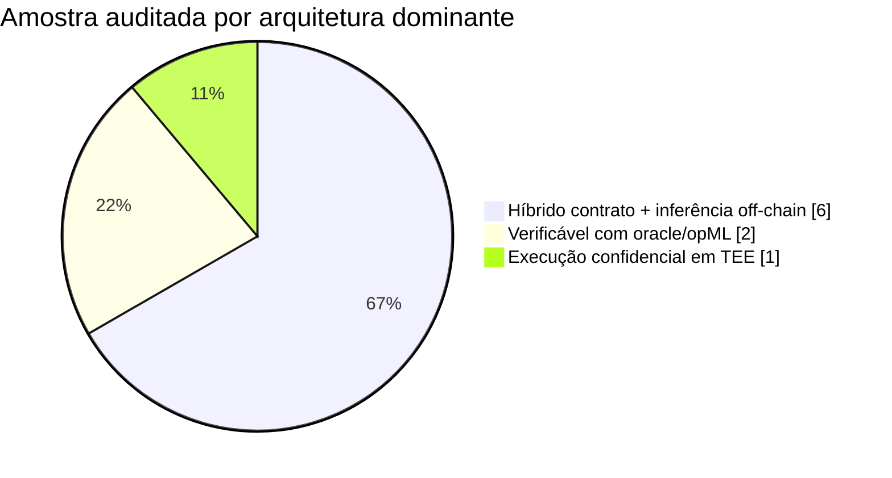
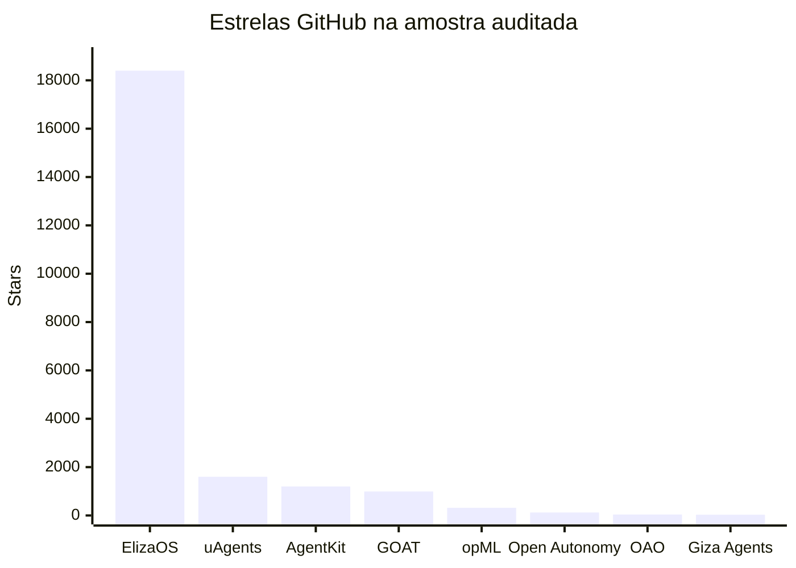
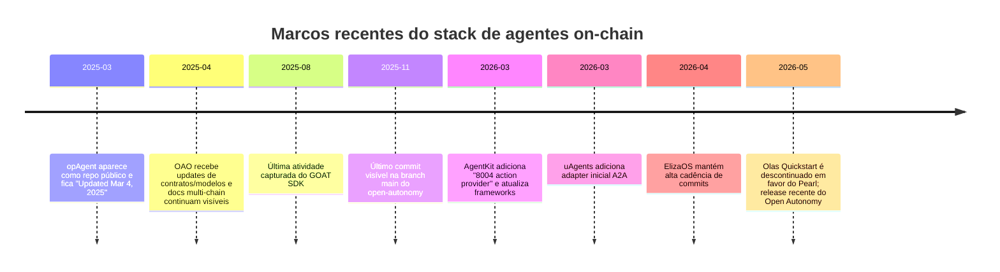

# Agentes de IA on-chain

## Resumo executivo

O mercado de “agentes de IA on-chain” já passou da fase puramente conceitual, mas a forma dominante em produção **não é** “um LLM inteiro rodando no blockchain”. O padrão real que aparece com mais frequência nas stacks auditadas é um **agente híbrido**: dinheiro, permissões, identidade, liquidação e partes do estado ficam em smart contracts, wallets ou registros on-chain; já inferência, memória longa, busca, observabilidade e orquestração pesada seguem off-chain, em APIs, runtimes especializados ou ambientes confidenciais, com verificação seletiva por oracle, opML, zkML ou TEE quando o custo/risco justifica. Esse desenho aparece de maneiras diferentes em AgentKit, GOAT, Olas, Giza, uAgents e ORA. citeturn53view0turn54view0turn17view2turn64view1turn52view0turn49view1

Em termos práticos, o campo hoje se organiza em três blocos. O primeiro é **wallet-first / execution-first**, no qual o foco é dar carteira, pagamentos e acesso a protocolos para um agente já existente; aqui entram AgentKit e GOAT. O segundo é **agent-network / service-network**, no qual o foco é descoberta, comunicação, registro e coordenação de agentes, como uAgents e Olas. O terceiro é **verifiable/confidential AI**, no qual a grande proposta é provar ou resguardar a execução do agente, como ORA com opML/OAO/opAgent, Giza com zkML/verificação, e Phala com TEE. citeturn53view0turn54view0turn51view1turn20view4turn50view1turn61view1turn64view1turn65view0

A parte mais importante do ecossistema, do ponto de vista de produto, **não é o modelo base**; é a camada operacional: compilação de prompts, guardrails, validação de ações, wallets/smart accounts, execução segura e observabilidade. O melhor indício recente disso é o paper de campo sobre agentes on-chain com capital real: em 21 dias, 3.505 agentes financiados por usuários geraram cerca de 300 mil ações on-chain, ~US$ 20 milhões em volume e 99,9% de sucesso de settlement para transações validadas por política, com os autores concluindo que a confiabilidade veio da camada operacional ao redor do modelo, não apenas do modelo em si. citeturn67academia1

Quanto aos LLMs comerciais priorizados por você, a leitura mais honesta é esta: **Perplexity, Grok/xAI e Gemini/Google estão claramente em estratégia API/protocolo/interop, não em estratégia chain-native própria**. A documentação oficial revisada mostra Agent API, Search API, Sonar e MCP Server na Perplexity; modelos, web/X search, multi-agent e remote MCP tools na xAI; e Gemini API + A2A no ecossistema Google. Não apareceu, no material oficial auditado aqui, uma camada nativa de wallets, smart contracts, token, oracle ou settlement construída por esses provedores. Quando eles chegam “on-chain”, isso normalmente ocorre por meio de frameworks de terceiros, wrappers e toolkits. Isso é especialmente visível no ElizaOS, que declara suporte a Gemini e Grok, e no uAgents, que já expõe exemplos de A2A. citeturn44view0turn44view1turn44view2turn44view3turn42view1turn42view2turn52view1

Como termômetro de comunidade de desenvolvedores, o maior magnetismo aberto da amostra auditada está em **ElizaOS**, seguido por **uAgents**, **AgentKit** e **GOAT**; as camadas mais ambiciosas de verificabilidade, como **opML/OAO** e **Giza Agents**, têm pegada técnica forte, mas menor superfície de adoção aberta no GitHub. Entre os riscos, o conjunto mais crítico segue sendo: vazamento de credenciais, prompt injection, uso inseguro de oracles, baixa auditabilidade de inferência, confiança excessiva em TEEs e incerteza regulatória sobre responsabilidade e atos autônomos de agentes. citeturn56view0turn52view0turn53view0turn54view0turn59view0turn64view1turn39news2turn39academia7turn68academia4

Minha conclusão central é que, nos próximos 6–18 meses, o “vencedor” não deve ser o agente mais “on-chain” no sentido ideológico, mas o agente que combinar melhor **custódia programável + verificação seletiva + confidencialidade + interoperabilidade entre agentes + custos aceitáveis de settlement**. A direção técnica mais promissora é menos “LLM dentro do contrato” e mais “contrato, wallet e política dentro de uma malha operacional verificável”. Isso é consistente com ORA, Phala, uAgents/A2A, AgentKit, GOAT e com a literatura mais recente sobre L2s e economias de agentes. citeturn50view1turn65view0turn52view1turn53view0turn54view0turn39academia9turn39academia11turn32academia4

## Definições e taxonomia

A melhor definição operacional de **agente de IA on-chain** não é “o modelo roda no blockchain”, e sim: **um sistema agentic cuja autoridade econômica, parte relevante das regras de ação, algum estado persistente, ou a liquidação/identidade/reputação do agente são ancorados on-chain**. Em AgentKit, o foco é dar wallet e interação on-chain ao agente; em GOAT, blockchains, stablecoins e wallets são explicitamente “infraestrutura para agentes virarem atores econômicos”; em uAgents, a rede de agentes é registrada no Almanac, um smart contract da Fetch.ai; e em ORA opAgent a proposta é ir além, empurrando nascimento, propriedade, chat e actions a uma camada mais explicitamente on-chain. citeturn53view0turn54view0turn52view0turn49view1

Na prática, a taxonomia mais útil é por **onde a cognição roda** e por **onde a autoridade vive**. Nessa matriz, há pelo menos cinco famílias:

| Família | O que é | Exemplo auditado |
| --- | --- | --- |
| Wallet-first | O agente já existe; a stack adiciona carteira, pagamentos e tool use on-chain | AgentKit, GOAT citeturn53view0turn54view0 |
| Network/service-first | A stack organiza descoberta, protocolos e coordenação entre agentes | uAgents, Olas citeturn51view1turn20view4 |
| Oracle/verifiable-AI | O contrato pede inferência e recebe resultado com mecanismos de verificação/fraud proof | ORA OAO/opML citeturn50view1turn59view0 |
| Contract-native agent | O agente é representado por contrato e executa callbacks on-chain | ORA opAgent citeturn49view1turn61view1 |
| Confidential agent runtime | O agente não é plenamente on-chain, mas roda com TEE/attestation e segredos isolados | Phala dstack citeturn65view0turn65view3 |

No conjunto público que consegui auditar com repositórios/documentação acessíveis, a distribuição por arquitetura dominante ficou assim. Não é “market share”; é apenas a composição da **amostra auditada** neste relatório. citeturn58view0turn60view3turn62view0turn64view1turn52view0turn65view0turn56view0turn53view0turn54view0



O ponto mais subestimado nessa taxonomia é que **“on-chain” não é binário**. Há uma escada de on-chainness. Um agente pode ser apenas economicamente on-chain, sem ser cognitivamente on-chain. Pode ser on-chain no wallet layer, mas off-chain no planner layer. Pode ser off-chain no planner, porém verificável on-chain no resultado. Pode depender de TEE para privacidade e ainda assim liquidar tudo em contrato. É por isso que comparar projetos apenas pela presença de um token ou de um contrato é uma má heurística. citeturn53view0turn54view0turn50view1turn65view0turn49view1

## Arquiteturas técnicas

A arquitetura dominante hoje é a que eu chamaria de **“agente híbrido com liquidação on-chain e inferência off-chain”**. Ela aparece em Olas, AgentKit, GOAT, uAgents e Giza. O fluxo típico é: um usuário ou estratégia define objetivo e limites; um planner/LLM off-chain decide a próxima ação; um policy engine e um wallet layer traduzem isso para uma ação segura; a execução e o settlement acontecem em smart contracts; e, quando necessário, um oracle ou camada de verificação atesta que a decisão ou inferência respeitou o processo esperado. citeturn17view2turn53view0turn54view0turn52view0turn64view1

```text
usuário / mandato / estratégia
        ↓
LLM / planner / retrieval / memória
        ↓
guards, policy engine, limites de risco
        ↓
wallet / smart account / Safe / assinatura programável
        ↓
smart contracts e protocolos on-chain
        ↕
oracle / verifier / attestation layer
        ↕
indexing, RPC, search, observabilidade
```

Nos projetos auditados, os **smart contracts** cumprem três papéis principais. Primeiro, **custódia e execução econômica**: AgentKit e GOAT deixam isso explícito ao girar em torno de wallets, stablecoins, pagamentos e transações; Olas expõe Safe ETH SDK e scripts de deployment/termination on-chain; opAgent transforma o agente em contrato com callbacks; e Giza espera a verificação do resultado antes da execução do contrato. Segundo, **registro/descoberta/reputação**: uAgents registra agentes no Almanac e expõe protocols, wallet messaging e payment protocol. Terceiro, **vernacular de verificação**: em ORA, o contrato opML, o AIOracle contract e os user contracts compõem a superfície verificável. citeturn53view0turn54view0turn17view2turn61view1turn64view1turn52view0turn50view1

O papel dos **oracles** muda muito quando o objeto oracular deixa de ser preço e passa a ser **inferência**. No ORA OAO, o oracle não apenas transporta um dado; ele transporta uma inferência de ML com um processo de challenge/fraud proof via opML. Essa é uma diferença estrutural importante: o risco deixa de ser apenas manipulação de feed de preço e passa a incluir model substitution, replay, prompt tampering e impugnação de resultados. Por isso faz sentido tratar “AI oracle” como uma categoria própria de middleware. Ao mesmo tempo, a literatura de segurança em DeFi continua válida: protocolos que dependem de oracles seguem vulneráveis a manipulação e arbitragem se a camada de consumo do dado for mal projetada. citeturn50view1turn59view0turn68academia4

Sobre **MPC**, a observação mais honesta desta coleta é que ele aparece menos, explicitamente, que smart accounts, multisigs e wallets programáveis. O Olas template expõe integração com Safe ETH SDK; o opAgent enfatiza “smart contract–based wallets” em vez de chave privada central; e o AgentKit se apresenta como wallet-agnostic. Minha leitura é que MPC continua relevante como técnica de custódia, mas, nas stacks auditadas, o desenho mais visível e mais documentado é o de smart accounts/multisigs na borda econômica do agente, não MPC como centro do framework. Isso é uma inferência a partir das fontes auditadas, não uma negação do uso de MPC no mercado mais amplo. citeturn17view2turn49view1turn53view0

Quanto a **zkML e provas criptográficas**, o quadro ainda é de maturidade seletiva. A ORA assume uma posição explícita: seu OAO é alimentado por opML, e a documentação argumenta que a abordagem é mais eficiente e prática que zkML para rodar modelos avançados com custo aceitável. Já a Giza se posiciona fortemente no eixo zkML/zero-knowledge, com hub de zkML, tópicos explícitos de zk/zkml em seus repositórios e o framework LuminAIR para integridade de grafos computacionais com provas STARK. Em outras palavras: zkML existe e avança, mas o mercado de produto parece, por enquanto, mais confortável com **prova otimista/fraud proof** ou com **verificação seletiva** do que com prova zero-knowledge total de toda a trajetória do agente. citeturn50view1turn59view0turn47view0turn64view1

Em **TEE/confidential computing**, Phala é uma peça importante porque explicita uma proposta que o mercado on-chain/agentic precisa: isolar segredos, dados sensíveis e execução em ambiente atestado. O README do dstack é claro ao descrever deploy de apps Docker em TEE, gerenciamento seguro de secrets, attestation, RA-TLS e um conjunto de componentes para CVMs. A implicação prática é forte: em vez de forçar tudo para o contrato, você preserva privacidade e integridade em uma camada confidencial, e liquida aquilo que precisa ser on-chain. Isso atende especialmente casos em que o agente precisa custodiar credenciais, acessar APIs privadas ou trabalhar com dados que não podem ir ao ledger público. citeturn65view0turn65view3

Por fim, sobre **rollups e L2s especializados**, o ecossistema está mais avançado em tese e protótipo do que em adoção consolidada. O paper AGNT2 argumenta que interações entre agentes exigem uma camada de execução própria, com state channels para pares recorrentes, rollup com ordenação dependência-aware e settlement com fraud proofs na root chain. A tese faz sentido econômico porque agentes geram interações frequentes, pequenas e semanticamente ricas. O que ainda não aparece, de forma madura, é uma massa crítica de produção em L2s já desenhados para esse padrão. Minha leitura é que isso será uma das frentes mais promissoras do próximo ciclo. citeturn39academia9

## Plataformas, protocolos e tooling

A tabela abaixo resume as stacks públicas mais relevantes e auditáveis que consegui validar nesta sessão. Os números de stars, releases e commits são **snapshots das páginas capturadas entre março e maio de 2026**, portanto servem mais como sinal de atividade relativa do que como auditoria forense exata. Quando o parser não expôs um dado com clareza, eu marquei isso explicitamente. citeturn56view0turn52view0turn53view0turn54view0turn58view0turn64view1

| Nome | Descrição | Repo | Último commit visível | Stars | Licença | Linguagem principal | Funding/status | Componentes on-chain | Tokenomics | Fontes |
| --- | --- | --- | --- | --- | --- | --- | --- | --- | --- | --- |
| Olas Open Autonomy | Framework para criar serviços de agentes autônomos; no ecossistema Olas, o quickstart foi descontinuado em favor do Pearl em maio/2026. | `https://github.com/valory-xyz/open-autonomy` | 2025-11-03 na `main`; release mais novo capturado em 2026-05-18 | 121 | Apache-2.0 | Python | **Maduro/ativo**; migração operacional para Pearl | service NFT, agent EOAs, Safe, deployment/termination on-chain | n/d nesta coleta | citeturn57view1turn57view0turn58view0turn20view4turn17view2 |
| ORA OAO | AI oracle verificável para smart contracts, alimentado por opML; docs mostram múltiplas implantações de contratos em várias redes. | `https://github.com/ora-io/OAO` | 2025-04-10 | 39 | n/d na página capturada | Solidity | **Ativo**, com docs e endpoints vivos | opML contract, AIOracle contract, user contracts, nós TORA | usa $ORA; docs mostram tokenomics com Neurons, Axons e rewards LP | citeturn50view1turn60view2turn60view3turn50view0 |
| ORA opAgent | Framework de “agentes perpétuos” on-chain; o contrato do agente conversa on-chain via OAO e off-chain via RMS. | `https://github.com/ora-io/opagent` | 2025-03-04 como “Updated” na org; commit page não ficou estável no parser | 14 | n/d na página capturada | Solidity/TypeScript | **Experimental**, com suporte explícito a Base na captura | smart-contract wallet, callbacks on-chain, chat on-chain, ações on-chain customizadas | 0,25 $ORA por deployment/chat na captura | citeturn49view1turn61view1turn61view0 |
| ORA opML | Camada de optimistic machine learning com challenge/fault proofs para inferência off-chain verificável. | `https://github.com/ora-io/opml` | 2024-12-11 | 315 | MIT | Solidity | **Base técnica importante**, mas atividade pública capturada é menor que OAO/opAgent | motor de dispute/fault proof, contratos merkleizados, challenge game | infraestrutura para o stack ORA; sem token próprio separado na captura | citeturn59view0turn60view0 |
| Giza Agents | Framework para integração “trust-minimized” entre ML e estratégia/ação on-chain, com memória e reflexão agentic. | `https://github.com/gizatechxyz/giza-agents` | 2024-06-26 | 31 | MIT | Python | **Experimental**; empresa ativa, mas o repo auditado está relativamente quieto | verificação de predição + execução posterior em contratos | nenhuma tokenômica oficial identificada na coleta | citeturn63view0turn64view0turn64view1turn47view0 |
| Fetch.ai uAgents | Framework para agentes descentralizados com registro no Almanac, protocolos de comunicação, wallet messaging e payment protocol. | `https://github.com/fetchai/uAgents` | 2026-04-17 | 1.6k | Apache-2.0 | Python | **Maduro/ativo**; docs, examples e Agentverse vivos | registro em smart contract, token sending, payment protocol, A2A adapter | economia ASI/Fetch aparece no ecossistema, mas a tokenômica detalhada não foi extraída nesta coleta | citeturn52view0turn52view1turn51view0turn51view1 |
| Phala dstack | SDK de deploy de apps/agents em TEE, focado em segredos, attestation e isolamento de execução. | `https://github.com/Phala-Network/dstack` | n/d no parser; repo mostra 501 commits e org/docs ativos | 15 | n/d na página capturada | Rust | **Ativo**; nuvem/confidential AI e docs em 2026 | TEE/CVM, attestation, KMS, RA-TLS, isolamento de secrets | tokenômica não detalhada na captura | citeturn65view0turn47view2turn65view2turn65view3 |
| elizaOS | Sistema operacional/framework open-source para agentes, model-agnostic, com plugins e conectores; on-chain não é o core, mas o ecossistema é muito importante para agentes cripto. | `https://github.com/elizaOS/eliza` | 2026-04-18 | 18.4k | MIT | TypeScript | **Muito ativo**; release mais recente capturada em 2026-05-20 | plugins, integrações cripto e algum Solidity; mais “agent OS” do que settlement layer | sem tokenômica oficial no repo auditado | citeturn55view1turn56view0turn55view0 |
| Coinbase AgentKit | Toolkit da Coinbase para dar wallet e interações on-chain a agentes de IA; framework-agnostic e wallet-agnostic. | `https://github.com/coinbase/agentkit` | 2026-03-23 | 1.2k | `LICENSE.md` visível, tipo não exposto pelo parser | TypeScript/Python | **Muito ativo**; commits em mar/2026 e integração crescente de ações | wallet, stablecoin payments, on-chain actions, 8004 action provider | sem token | citeturn53view0turn53view1 |
| GOAT SDK | Toolkit de finanças agênticas: pagamentos, compras, yield, prediction markets, compra de ativos e tokenização. | `https://github.com/goat-sdk/goat` | 2025-08-19 | 991 | MIT | TypeScript/Python | **Ativo**, embora a captura pública de commits esteja mais antiga | wallet, payments, tokenization, investment tools, prediction markets | sem token | citeturn54view0turn54view1 |

Além dos projetos acima, há nomes importantes que são relevantes para a narrativa do setor, mas menos auditáveis publicamente nesta sessão. O caso mais claro foi **Ritual**: a organização oficial no GitHub está verificada, se descreve como “the world's sovereign chain for AI”, mas **não apresenta repositórios públicos**, o que dificulta auditar licenças, atividade de código, arquitetura detalhada e maturidade técnica pelo mesmo padrão aplicado aos projetos acima. citeturn47view1

O gráfico abaixo mostra a popularidade relativa da amostra pública por stars no GitHub. Ele é útil como proxy de atenção de desenvolvedores, não como medida de TVL, receita ou qualidade técnica. citeturn56view0turn52view0turn53view0turn54view0turn59view0turn58view0turn64view1



Comparativamente, eu classificaria a maturidade assim. **Mais maduros para builders hoje**: ElizaOS, uAgents, AgentKit e GOAT, porque tornam fácil montar agentes que já podem usar modelos comerciais, carteiras e ferramentas. **Mais maduros para arquitetura/protocolo**: Olas, pela noção de serviços/agentes com estado e lifecycle on-chain; ORA, pela ambição de verificação e oracularização de inferência. **Mais promissores para sigilo e produção séria**: Phala/dstack. **Mais promissores para estratégias verificáveis específicas**: Giza. citeturn55view0turn52view0turn53view0turn54view0turn20view4turn50view1turn65view0turn64view1

## Integrações com Perplexity, Grok e Gemini

Se o objetivo é entender “estratégia on-chain” dos grandes provedores de LLM, o ponto mais importante é separar **produto oficial** de **uso on-chain por terceiros**. Nas fontes oficiais que revisei, a Perplexity oferece Agent API, Search API, Sonar API, Perplexity SDK e um MCP Server; a xAI oferece modelos Grok, web search, X search, multi-agent e remote MCP tools; e o ecossistema Google oferece Gemini API e empurra A2A como protocolo aberto de interoperabilidade entre agentes. Em nenhum desses três casos apareceu uma camada oficial do tipo wallet stack, settlement protocol, token ou oracle on-chain nativo do provedor. Essa leitura é uma inferência direta do que **está presente** nas documentações oficiais e do que **não aparece** nelas. citeturn44view0turn44view1turn44view2turn44view3

| Provedor | O que a superfície oficial oferece | Evidência de integração com agentes | Leitura para uso on-chain |
| --- | --- | --- | --- |
| Perplexity | Agent API, Search API, Sonar API, SDK e MCP Server. citeturn44view0 | A própria docs é explícita em “For AI agents”; o fit natural é retrieval, search grounding e Q&A em tempo real. citeturn44view0 | Excelente como “cérebro de pesquisa” de agentes financeiros, copilotos de governança e orquestradores de tool use; **não aparece como stack chain-native própria** nas fontes oficiais auditadas. citeturn44view0 |
| Grok / xAI | Modelos Grok via API, web search, X search, multi-agent, collections/RAG e remote MCP tools. citeturn44view1 | O ElizaOS declara suporte a Grok, o que facilita usar Grok em agentes com plugins e conectores. citeturn42view1 | Forte para agentes orientados a fluxo de informação em tempo real e sinais sociais; **a estratégia oficial observada é API/produto/MCP, não blockchain nativa**. citeturn44view1turn42view1 |
| Gemini / Google | Gemini API e, no ecossistema Google, A2A como protocolo aberto para comunicação entre agentes. citeturn44view3turn44view2 | ElizaOS suporta Gemini; uAgents já mostra adapter A2A e exemplos de sistemas multiagente conectados. citeturn42view2turn52view1 | O vetor competitivo do Google parece ser **interoperabilidade e plataforma**, não settlement on-chain próprio. Para builders, isso favorece compor Gemini com wallets, contracts e SDKs de terceiros. citeturn44view2turn44view3turn52view1 |

A implicação prática para builders cripto é simples. Se você quer **search grounding** e respostas citadas, Perplexity é especialmente interessante. Se quer **contexto social em tempo real** e integração com ecossistema X, Grok/xAI é chamativo. Se quer **ecossistema enterprise, interop e padronização entre agentes**, Gemini + A2A sai na frente. Mas, em todos os três casos, a parte “on-chain” provavelmente continuará sendo entregue por camadas como AgentKit, GOAT, Olas, uAgents, ORA, Giza, Phala ou por middleware de wallets/oracles. citeturn44view0turn44view1turn44view2turn44view3turn53view0turn54view0turn20view4turn51view1turn50view1turn64view1turn65view0

Há também um sinal importante de convergência: **MCP e A2A** estão começando a virar a cola entre a camada agentic e a camada blockchain/tooling. A Perplexity já publica MCP Server; a xAI já documenta remote MCP tools; o Google posiciona A2A como protocolo de comunicação entre agentes; e o uAgents adicionou adapter A2A em commits recentes. Minha leitura é que a próxima onda de agentes on-chain usará menos integrações ad hoc e mais protocolos padronizados na borda de ferramentas e na borda de colaboração entre agentes. citeturn44view0turn44view1turn44view2turn52view1

## Riscos, privacidade, regulação e incentivos

O maior risco técnico não é “o agente errar uma resposta”; é **ele transformar um erro de raciocínio em uma ação irreversível com capital, credenciais ou efeitos regulatórios**. A literatura mais recente sobre agentes on-chain sob capital real é contundente: os problemas relevantes aparecem no caminho completo entre mandato do usuário, prompt, validação, ação e settlement. Os autores do estudo do DX Terminal mostram falhas como regras de trade inventadas, paralisia por taxa, anchoring numérico e má leitura de tokenômica; e mostram também que isso só melhorou com harness, validação e observabilidade operacional. citeturn67academia1

Na camada de segurança, quatro classes de risco concentram a maior parte do dano esperado. A primeira é **vazamento de segredos e credenciais**. Casos recentes em agentes pessoais como OpenClaw mostraram que ambientes agentic já viraram alvo de infostealers, e a imprensa e a documentação pública em torno desses sistemas tornaram visível o problema de configurações com tokens, autenticação e permissões amplas. A segunda é **prompt injection e tool abuse**, especialmente quando o agente pode chamar ferramentas sem uma camada robusta de policy enforcement. A terceira é **manipulação de oracles e consumo ingênuo de dados**, velha conhecida de DeFi, agora ampliada para inferência e conteúdo. A quarta é **falsa sensação de verificação**: o repositório do opML da ORA traz aviso explícito de que o código é “unaudited”, mostrando que marketing de verificabilidade não substitui auditoria. citeturn39news2turn39search8turn68academia4turn59view0

Do ponto de vista de privacidade, há uma tensão estrutural. Quanto mais on-chain for o agente, maior tende a ser a transparência e a auditabilidade, mas pior tende a ser a privacidade. O opAgent, por exemplo, vende a ideia de “smart contract–based wallets” e decisões verificáveis on-chain; já a Phala aposta no extremo oposto: mover o que é sensível para TEE, com secrets isolados, attestation e RA-TLS. A indústria provavelmente convergirá para um meio-termo: **estado econômico e regras críticas visíveis**, mas dados sensíveis, chaves, retrieval privado e parte da cognição protegidos por TEE, enclaves ou provas seletivas. citeturn49view1turn65view0turn65view3

Os modelos econômicos e de incentivo também estão se organizando. O padrão mais básico é o de **agente-paga-para-agir**: gas, API, oracle, inference e tool fees. Em ORA opAgent, a própria docs captura uma taxa de 0,25 $ORA por deployment e por interação de chat. No ORA “Foundation”, a tokenomics oficial vai além: $ORA funciona como meio de troca, enquanto “Neurons” e “Axons” expressam um desenho de pools e emissões. Em AgentKit, o ganho óbvio é monetizar agentes via pagamentos e stablecoins. Em GOAT, a proposta é transformar o agente em ator financeiro capaz de pagar, comprar, gerar yield, apostar em prediction markets e tokenizar ativos. Na literatura, ClawCoin empurra a lógica mais longe e propõe uma unidade de conta indexada a custo computacional para economias de agentes. citeturn61view1turn50view0turn53view0turn54view0turn39academia11

Na frente regulatória, a peça mais sólida da coleta é o paper sobre regulação de agentes sob o EU AI Act e direito contratual europeu. A tese dos autores é importante para o mundo on-chain: agentes devem ser tratados como “AI systems” com ênfase regulatória na **camada de orquestração**, justamente porque a autonomia emerge da combinação de modelos, ferramentas e ambientes externos. Eles também propõem um sistema de autorização graduada, em “semáforo”, para delegação de atos por agentes. Para agentes on-chain que mexem com treasury, trade, procurement, lending, compliance e governance, isso sugere uma direção clara: permissionamento graduado, registros auditáveis e limites por classe de ação. citeturn39academia7

Minha visão é que o maior erro de produto, daqui em diante, será vender “autonomia total” sem investir pesado em **escopos, limites, cofres separados, observabilidade e reversibilidade econômica sempre que possível**. A tecnologia já permite agentes executarem bastante coisa; o problema é que o custo de uma má autorização cresce muito quando a ação termina em contrato, stablecoin, bridge ou protocolo de mercado. citeturn67academia1turn53view0turn54view0turn68academia4

## Casos de uso, avanços recentes e previsões

Os casos de uso mais concretos da amostra se concentram em cinco frentes. A primeira é **execução financeira e treasury**: pagamentos, swaps, prediction markets, compra de ativos e gestão de liquidez, terreno natural de AgentKit e GOAT. A segunda é **estratégia/verificação**: agentes que produzem uma decisão e só depois executam o contrato quando a predição ou inferência foi verificada, como em Giza e ORA. A terceira é **coordenação multiagente**: uAgents/Agentverse e Olas entram aqui. A quarta é **agentes de consumo e brand agents**, muito forte em Fetch.ai/ASI:One e Fetch Business. A quinta é **coprocessamento/confidencialidade**, em que o agente precisa operar com segredos, dados privados ou APIs sensíveis, caso típico de Phala. citeturn53view0turn54view0turn64view1turn50view1turn51view0turn51view1turn20view4turn65view0

O melhor caso real publicado de agentes com capital real, no entanto, é o estudo do DX Terminal Pro. Ele importa porque desloca a conversa de “demo de agente” para **operação sob dinheiro de verdade**. São 7,5 milhões de invocações agentic, cerca de 300 mil ações on-chain, mais de 5.000 ETH implantados e 99,9% de settlement bem-sucedido nas transações que passaram pela política. Esse material muda o debate: mostra que o avanço do setor virá menos de benchmarks conversacionais e mais de métricas como capital deployment, fail-safes, traceabilidade de decisões e sucesso de settlement. citeturn67academia1

Nos últimos 12 meses, eu destacaria sete breakthroughs ou sinais fortes. Primeiro, **A2A** avançou como padrão de comunicação entre agentes, e o uAgents já adicionou adapter inicial. Segundo, **MCP** virou peça relevante também no lado comercial, com Perplexity e xAI já publicando peças oficiais nessa direção. Terceiro, **ERC-8004** começou a aparecer como base para discutir identidade/registro de agentes on-chain, inclusive com um dataset acadêmico de 10.000 agentes em Ethereum. Quarto, a ORA continuou empurrando a fronteira de oracle de IA e de agentes perpétuos/verificáveis. Quinto, o Olas mudou seu runtime operacional do Quickstart para o Pearl. Sexto, AgentKit começou a incorporar providers de ação mais próximos de padrões agent-native, como “8004 action provider”. Sétimo, papers como AGNT2 e ClawCoin começaram a atacar a camada econômica e de infraestrutura para economias entre agentes, em vez de apenas a camada de inferência. citeturn44view2turn52view1turn44view0turn44view1turn39academia10turn49view1turn20view4turn53view1turn39academia9turn39academia11



Em sentimento de comunidade, o que consegui medir com confiança nesta sessão foi sobretudo **sentimento de desenvolvedor**. GitHub aponta atenção muito forte em ElizaOS, boa tração em uAgents, AgentKit e GOAT, e uma comunidade menor porém mais especializada em ORA/Giza. Fora do recorte estritamente cripto, o sentimento público em torno de agentes autônomos ficou mais cauteloso depois das discussões públicas sobre OpenClaw/Moltbook e incidentes de credenciais, o que provavelmente vai aumentar a pressão por TEEs, guardrails e sandboxes de tool use também no mundo on-chain. citeturn56view0turn52view0turn53view0turn54view0turn59view0turn64view1turn39news2turn39search8

Minhas previsões para os próximos 6–18 meses, claramente como **inferências** a partir das fontes auditadas, são as seguintes. A primeira é que o padrão dominante será **híbrido verificável**, não fully on-chain. A segunda é que veremos mais **padrões de identidade e capability discovery para agentes**, com A2A/MCP/registries se encontrando com objetos on-chain no estilo ERC-8004. A terceira é que **TEE e selective proof** virarão opção padrão para qualquer agente com credenciais ou dados privados. A quarta é que aparecerão propostas reais de **L2/appchain de interação entre agentes**, porque o custo de session state e de micro-interações ainda é alto demais nas chains generalistas. A quinta é que a regulação vai mirar a **camada de orquestração e autorização**, e não apenas o modelo base. citeturn67academia1turn39academia10turn44view2turn44view0turn44view1turn65view0turn39academia9turn39academia7

As maiores oportunidades continuam relativamente abertas. Faltam boas soluções de **estado/memória portável do agente**, **reputação verificável**, **abstração de conta realmente agent-native**, **simulação e backtesting de políticas antes da execução**, **camadas de seguro/slashing compatíveis com falha agentic** e **precificação econômica de inferência/coordenação**. Papers como ClawCoin e AGNT2 importam justamente porque já tratam o agente como unidade econômica e infraestrutural, não só como wrapper de LLM. citeturn39academia11turn39academia9turn32academia4

As limitações desta pesquisa são importantes. Não consegui recuperar, com qualidade suficiente, threads de Reddit/Hacker News/X diretamente indexáveis para citar sem degradar a confiança do relatório; por isso, a parte de “sentimento de comunidade” ficou ancorada principalmente em GitHub, documentação oficial, papers e cobertura pública de segurança. Também houve projetos comerciais ou parcialmente fechados cuja auditoria de código ficou incompleta, especialmente quando a organização oficial não mantinha repositórios públicos ou quando a documentação acessível nesta sessão era dominada por páginas muito dependentes de JavaScript. Em vez de preencher lacunas com inferência fraca, preferi marcá-las como lacunas. 

## Apêndices

**Links brutos selecionados**

```text
https://github.com/valory-xyz/open-autonomy
https://github.com/valory-xyz/quickstart
https://github.com/valory-xyz/langchain-hello-world
https://github.com/ora-io/OAO
https://github.com/ora-io/opml
https://github.com/ora-io/opagent
https://docs.ora.io/
https://github.com/gizatechxyz/giza-agents
https://github.com/fetchai/uAgents
https://uagents.fetch.ai/docs
https://www.fetch.ai/
https://github.com/coinbase/agentkit
https://github.com/goat-sdk/goat
https://github.com/elizaOS/eliza
https://github.com/Phala-Network/dstack
https://docs.phala.com/
https://phala.com/
https://docs.perplexity.ai/docs/getting-started/overview
https://docs.x.ai/overview
https://a2a-protocol.org/latest/
https://ai.google.dev/gemini-api/docs
```

**Excertos curtos e altamente relevantes de GitHub/docs**

AgentKit sintetiza bem a tese “wallet-first” do setor: “Every agent deserves a wallet.” citeturn53view0

uAgents deixa explícito o seu anchor on-chain ao dizer que cada agente pode entrar na rede “registering on the Almanac”, que ele próprio descreve como smart contract na Fetch.ai blockchain. citeturn52view0

O README do opML traz um alerta que quase todo builder deveria colar na parede: “This code is unaudited.” citeturn59view0

A docs do opAgent faz a promessa máxima do subsegmento contract-native ao afirmar que o ciclo do agente, “from birth and ownership to decision-making and evolution, is onchain.” citeturn49view1

A migração operacional do Olas ficou muito clara no aviso do Quickstart: “being discontinued on 4 May 2026.” citeturn20view4

No lado de interoperabilidade com modelos comerciais, o ElizaOS resume seu posicionamento em uma linha forte: suporte a modelos “including OpenAI, Gemini, Anthropic, Llama, and Grok.” citeturn42view1turn42view2

No lado de evolução recente do tooling, dois commits capturam a direção do mercado: AgentKit adicionando “8004 action provider” e uAgents adicionando “initial a2a adapter”. citeturn53view1turn52view1

**Observação sobre Reddit, Hacker News e X**

Eu não incluí trechos literais dessas plataformas porque, nesta sessão, a recuperação indexável dessas páginas ficou insuficiente para manter o padrão de citação forte que este relatório exige. Em pesquisas subsequentes, eu priorizaria capturas diretas de threads com boa indexação, mas preferi não preencher esse apêndice com links fracos ou não auditáveis.